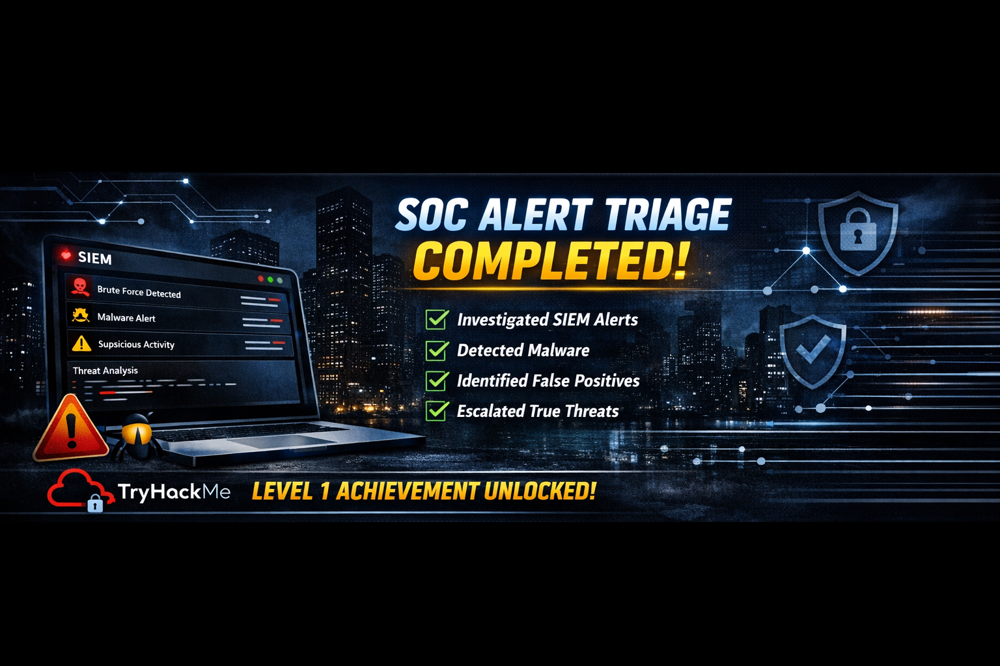

<p align="center">
  
</p>

# SOC L1 – Alert Triage (TryHackMe)
Hands-on SOC L1 project demonstrating alert triage &amp; incident analysis using TryHackMe


## Overview
This project demonstrates my ability to perform SOC Level 1 alert triage using a simulated SIEM environment. I analyzed multiple alerts, validated true/false positives, assigned priorities, and documented incident findings using SOC-standard procedures.

## Key Skills Demonstrated
- Alert triage & prioritization  
- Malware detection (double-extension file analysis)  
- Brute-force attack investigation  
- Data exfiltration analysis  
- False positive identification  
- Writing SOC-style analyst comments  
- Escalation decision-making  
- Understanding of attacker techniques (MITRE ATT&CK)

## What I Did
- Reviewed alerts generated by the SIEM  
- Identified malicious vs benign activity  
- Assigned correct severity, classification, and verdict  
- Wrote analyst comments explaining the reasoning  
- Escalated true positives to L2  
- Tuned out false positives (Zoom traffic, GitHub developer downloads)

## Example Alerts Investigated
- **Brute Force Attack (RDP)** – True Positive  
- **Double-Extension Malware Download** – True Positive  
- **Potential Data Exfiltration** – False Positive (Zoom)  
- **GitHub Repository Download** – False Positive (Developer activity)

## Outcome
Successfully completed the TryHackMe **SOC L1 Alert Triage** room, demonstrating readiness for real SOC workflows and incident handling.

---

### **4. Add Your Banner**
Upload the LinkedIn banner image to your repo:
- Click **Add file → Upload files**
- Upload the banner image
- Then, in your README, add this line at the top:

```markdown

